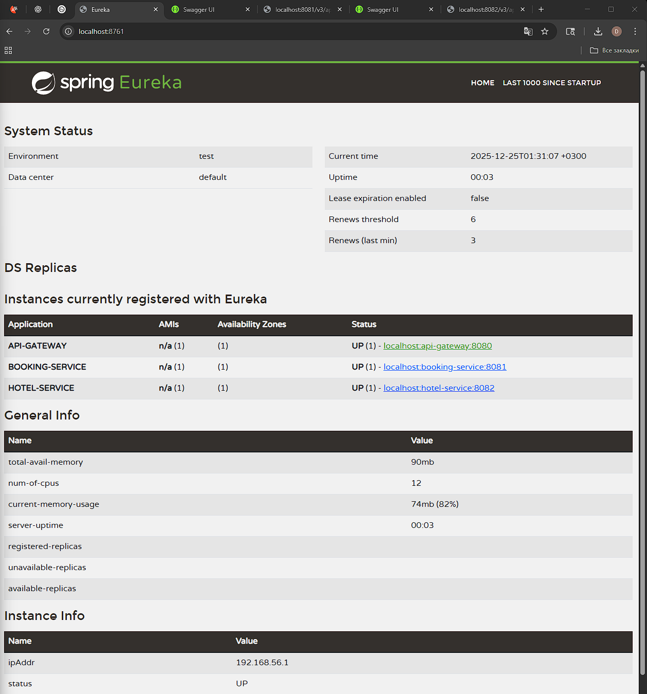
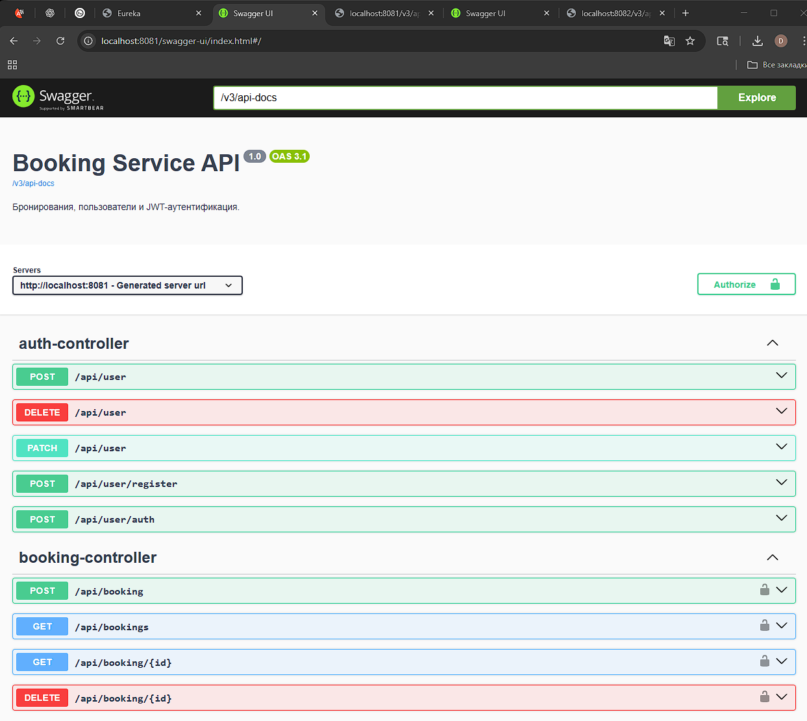
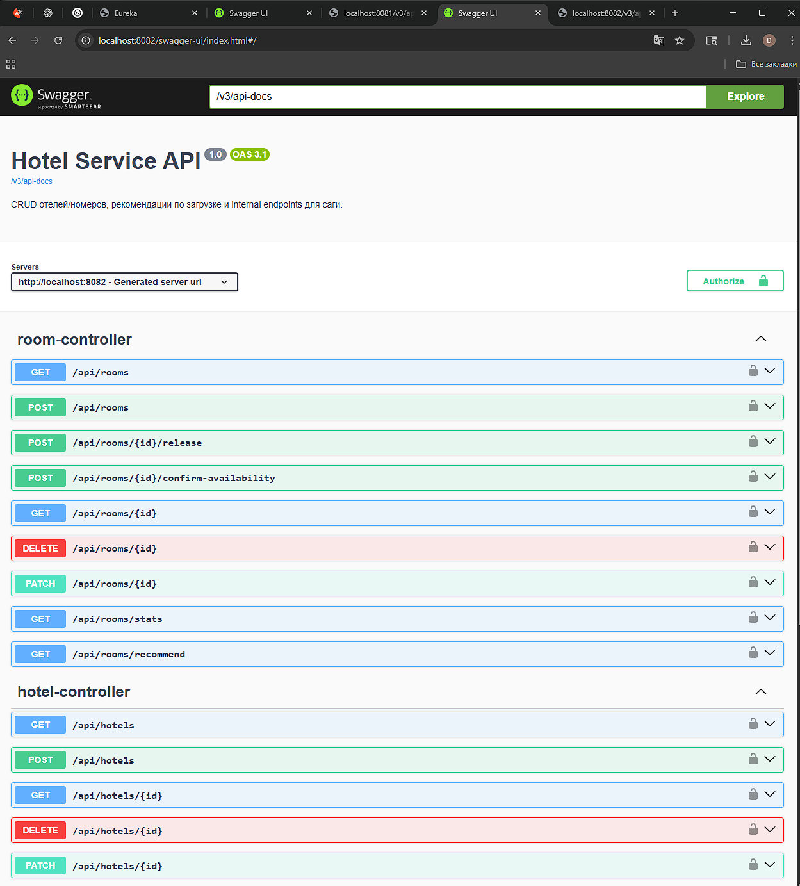
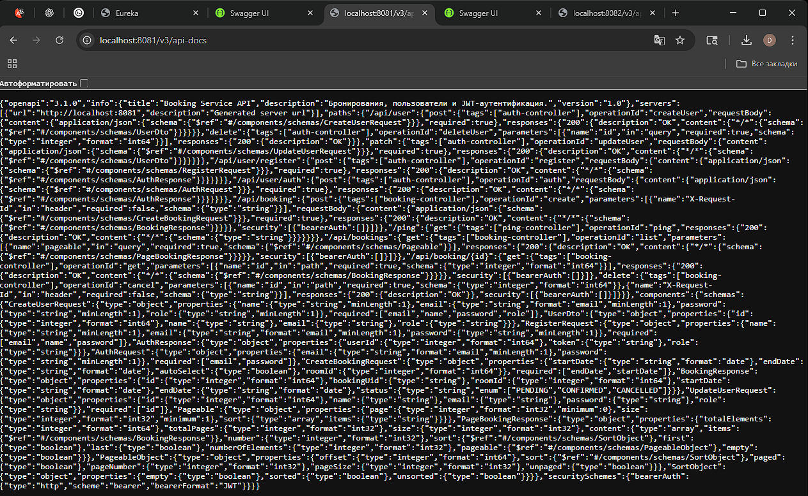
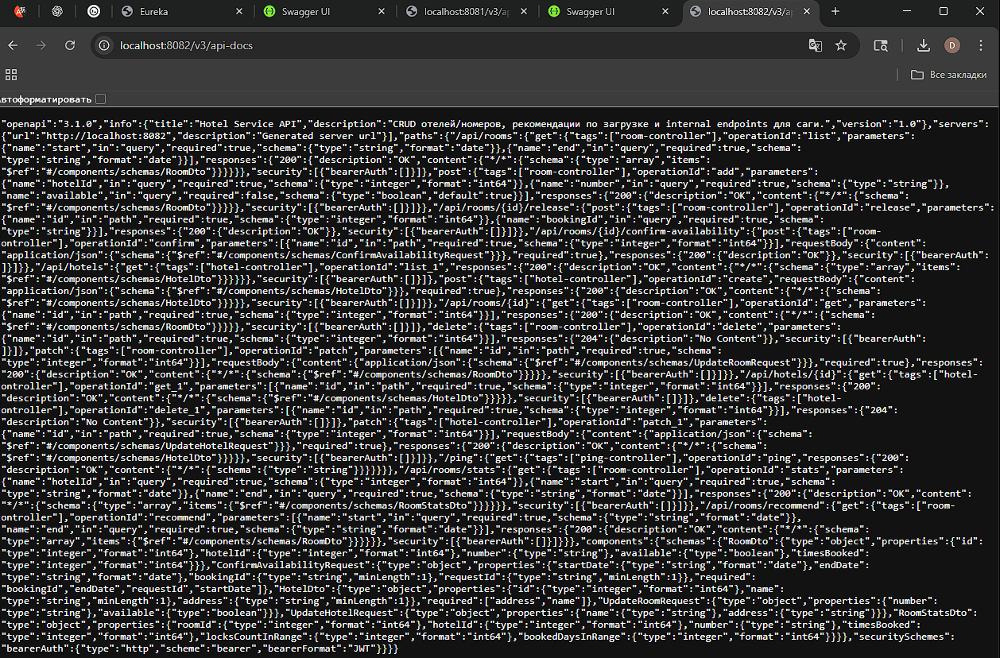
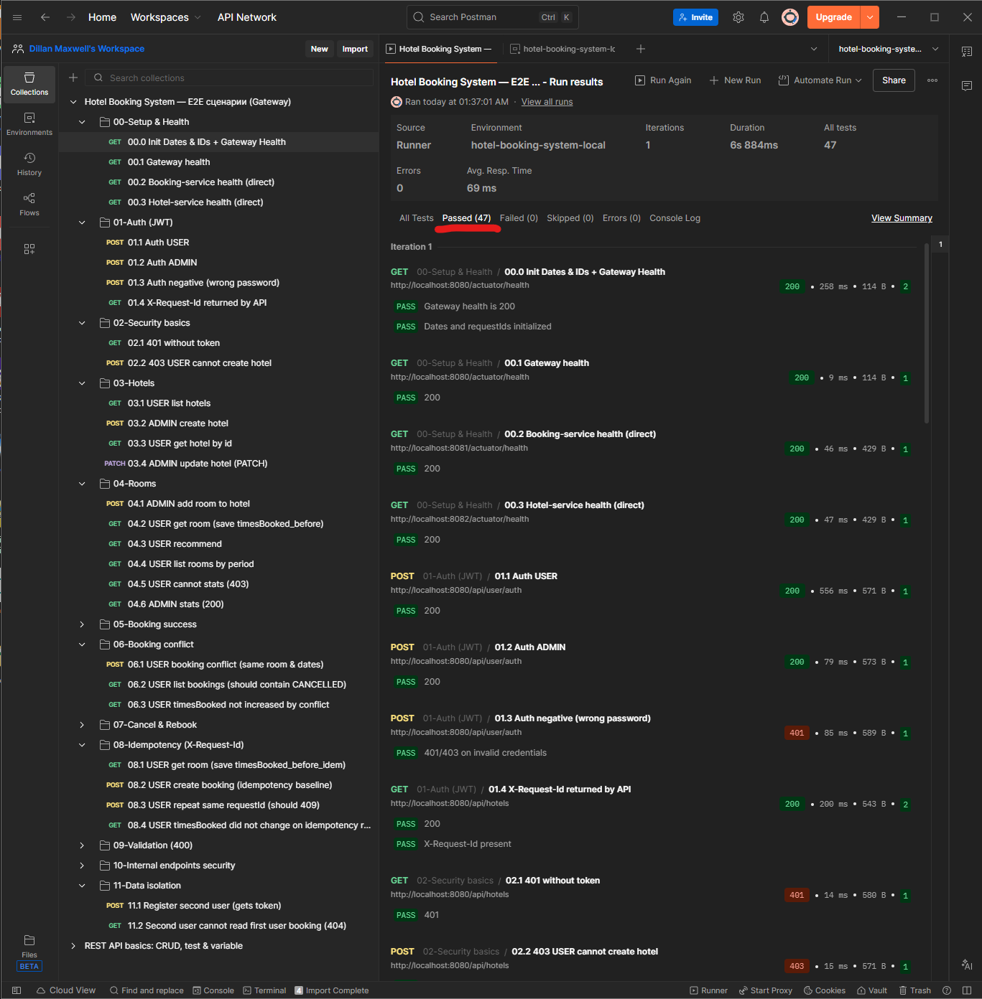
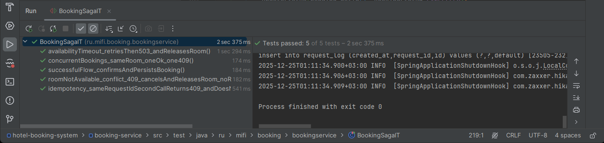
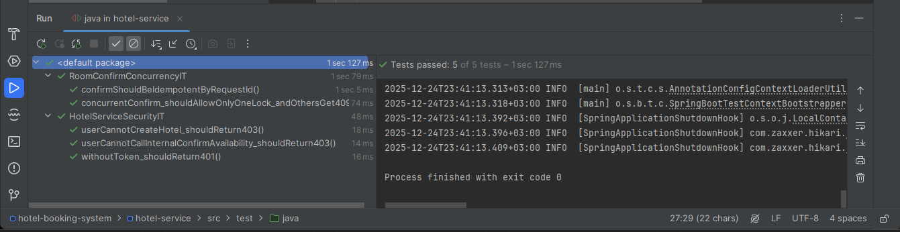

# Hotel Booking System — итоговый проект по Spring / REST API (МИФИ)

Учебный микросервисный проект: **API Gateway + Eureka + Hotel Service + Booking Service**.  
Ключевая фича — **бронирование как распределённая транзакция (сага confirm/release)** + **алгоритм рекомендаций номера**.

---

## 1) Стек и требования

- Java: **21+**
- Spring Boot: **3.5.8**
- Spring Cloud: **2025.0.0**
- БД: **H2 in-memory** в каждом сервисе
- Документация API: **Swagger / OpenAPI (springdoc)**

---

## 2) Архитектура и роли сервисов

Проект реализован как микросервисная система с единой точкой входа через `api-gateway`, сервисным discovery через `discovery-server (Eureka)` и согласованием бронирования через сагу в `booking-service` с компенсацией в `hotel-service`.

### 2.1 Схема взаимодействия сервисов

> Основная схема:

```mermaid
flowchart LR
  %% ===== Styles =====
  classDef infra fill:#0b1320,stroke:#334155,color:#e2e8f0;
  classDef gateway fill:#0f172a,stroke:#38bdf8,color:#e2e8f0;
  classDef svc fill:#111827,stroke:#a78bfa,color:#e2e8f0;
  classDef internal fill:#111827,stroke:#f59e0b,color:#e2e8f0,stroke-dasharray: 5 4;
  classDef note fill:#0b1320,stroke:#64748b,color:#cbd5e1;

  E[Eureka<br/>discovery-server<br/>:8761]:::infra

  G[api-gateway<br/>:8080<br/><b>Public API</b><br/>JWT + RBAC<br/>X-Request-Id]:::gateway

  B[booking-service<br/>:8081<br/>Users + Bookings<br/><b>Saga</b> + retries/timeouts<br/>Idempotency by X-Request-Id]:::svc

  H[hotel-service<br/>:8082<br/>Hotels + Rooms<br/>recommend + lock<br/>timesBooked]:::svc

  I1[confirm-availability<br/>(internal)]:::internal
  I2[release<br/>(internal)]:::internal

  %% discovery
  G -. service discovery .-> E
  B -. service discovery .-> E
  H -. service discovery .-> E

  %% public routes
  Client((Client/Postman)):::note -->|HTTP (public routes)| G
  G -->|/api/... (public)| B
  G -->|/api/... (public)| H

  %% saga internal calls
  B -->|direct internal call<br/>lb://hotel-service| I1
  B -->|compensation| I2
  I1 --> H
  I2 --> H
```

---

### 2.2 Роли и зоны ответственности

**api-gateway (:8080)**

* Единая точка входа для всех клиентов.
* Применяет безопасность: проверка JWT и ролей (RBAC — Role-Based Access Control).
* Пробрасывает/возвращает `X-Request-Id` для корреляции запросов и удобства диагностики.
* Прокидывает **только публичные** маршруты сервисов.

**discovery-server (:8761, Eureka)**

* Регистрация и обнаружение сервисов.
* Используется для обращения по `lb://<service-name>` и устойчивой маршрутизации.

**booking-service (:8081)**

* Доменные области: **Users + Bookings**.
* Реализует **сагу бронирования**:

  1. локально создаёт бронь `PENDING`
  2. вызывает `hotel-service` internal confirm-availability (с таймаутами и ретраями)
  3. при успехе → `CONFIRMED`
  4. при конфликте/ошибке → `CANCELLED` + компенсация `release`
* Реализует **идемпотентность** по `X-Request-Id`:

  * повторный запрос с тем же `X-Request-Id` → `409 CONFLICT`
  * внешние вызовы (recommend/confirm) при повторе **не выполняются** (защита от дублей и побочных эффектов)

**hotel-service (:8082)**

* Доменные области: **Hotels + Rooms**.
* Публичные функции: управление отелями/номерами, `recommend`.
* Internal функции для саги:

  * `confirm-availability` — блокировка/подтверждение доступности комнаты
  * `release` — компенсационное освобождение
* Поддерживает бизнес-счётчик `timesBooked`:

  * увеличивается при успешном confirm
  * уменьшается при release (отмена/компенсация)

---

### 2.3 Публичные vs Internal endpoints

**Публичные endpoints** доступны через `api-gateway` и предназначены для клиентов и ручной проверки:

* примеры: `GET /api/hotels`, `POST /api/booking`, `GET /api/rooms/recommend`

**Internal endpoints** предназначены только для шагов саги и **не должны быть доступны извне**:

* примеры:

  * `POST /api/rooms/{roomId}/confirm-availability`
  * `POST /api/rooms/{roomId}/release`

Правило проекта:

* `api-gateway` **не маршрутизирует internal endpoints** (их нет в public routes),
* `booking-service` вызывает `hotel-service` напрямую (service-to-service) через `lb://hotel-service`.

Это исключает возможность:

* внешнему клиенту “обойти” сагу и напрямую дернуть confirm/release,
* нарушить согласованность данных и безопасность.

---

### 2.4 Надёжность и согласованность

В проекте реализованы механизмы, которые повышают надёжность распределённого сценария бронирования:

* **Идемпотентность** запросов бронирования (`X-Request-Id`)
  Повтор запроса не приводит к повторному бронированию и повторным внешним вызовам.
* **Ретраи и таймауты** на вызовах `booking-service -> hotel-service`
  Нестабильность сети/сервиса не “ломает” систему: есть контролируемая повторная попытка.
* **Компенсация (Saga compensation)**
  При ошибке/конфликте выполняется `release`, а бронь переводится в `CANCELLED`.

---

### 2.5 Как это подтверждено тестами

* **Интеграционные тесты (JUnit + Spring Boot)** проверяют:

  * успех/конфликт/таймауты/идемпотентность в `booking-service`
  * конкурентность confirm и security в `hotel-service`
* **Postman E2E** проверяет:

  * сценарии через `api-gateway` (success/conflict/idempotency/401/403/400)
  * недоступность internal endpoint’ов через gateway

---

## 3) Быстрый запуск

Открыть 4 терминала в корне проекта и запустить:

1) Eureka:
```bash
mvn -pl discovery-server spring-boot:run
```

2) Hotel Service:
```bash
mvn -pl hotel-service spring-boot:run
```

3) Booking Service:
```bash
mvn -pl booking-service spring-boot:run
```

4) API Gateway:
```bash
mvn -pl api-gateway spring-boot:run
```

Порты по умолчанию:
- Eureka: `http://localhost:8761`
- Gateway: `http://localhost:8080`
- Booking Service: `http://localhost:8081`
- Hotel Service: `http://localhost:8082`



---

## 4) Предзаполнение данных

После старта сервисов автоматически создаются тестовые данные:

### Пользователи (booking-service)
- `admin@local / admin123` (роль **ADMIN**)
- `user@local / user123` (роль **USER**)

### Отели и комнаты (hotel-service)
- 3 отеля и 9 комнат (номера 101/102/201 …)

---

## 5) Swagger / OpenAPI

Swagger UI доступен напрямую в сервисах:

- Booking Service: `http://localhost:8081/swagger-ui/index.html`



- Hotel Service: `http://localhost:8082/swagger-ui/index.html`



OpenAPI JSON:
- `http://localhost:8081/v3/api-docs`



- `http://localhost:8082/v3/api-docs`



### Как авторизоваться в Swagger

1) Получите JWT токен через gateway:
    - `POST http://localhost:8080/api/user/auth`
2) В Swagger UI нажмите **Authorize** и вставьте токен (обычно достаточно **только значения токена**, без `Bearer `).

---

## 6) Postman - E2E проверка API (Gateway)

В проект добавлена Postman-коллекция для проверки основной бизнес-логики и безопасности системы бронирования.
Коллекция запускается через **Gateway** и покрывает ключевые сценарии: success / conflict / idempotency, а также 401/403/400 и изоляцию данных между пользователями.

---

### 1) Что лежит в репозитории

- `postman/postman_collection.json` — коллекция запросов + автотесты (assert'ы).
- `postman/postman_environment.json` — окружение (base urls, учётки, runtime-переменные).
- `postman/results/` — экспортированные результаты прогонов (JSON).
- `docs/screenshots/postman-run-all-tests-ok.png` — скриншот успешного прогона (например, **47 passed**).

---

### 2) Что проверяют тесты (покрытие)

Коллекция запускает сценарии по папкам:

- **00-Setup & Health**
   - Инициализация дат и `X-Request-Id` (генерация `reqId_*`)
   - Health-check Gateway/Booking/Hotel
- **01-Auth (JWT)**
   - Получение JWT для USER и ADMIN
   - Негативный логин (wrong password)
   - Проверка, что API возвращает `X-Request-Id`
- **02-Security basics**
   - `401` без токена
   - `403` при попытке USER вызвать admin-операции
- **03-Hotels**
   - USER читает список/карточку
   - ADMIN создаёт/обновляет отель
- **04-Rooms**
   - ADMIN добавляет комнату
   - USER читает комнату (с фиксацией `timesBooked`)
   - recommend/list по периоду
   - stats: `403` для USER и `200` для ADMIN
- **05-Booking success**
   - Бронирование (PENDING → CONFIRMED)
   - Проверка, что `timesBooked` увеличился
- **06-Booking conflict**
   - Повтор бронирования той же комнаты на тот же период → `409`
   - Проверка, что `timesBooked` не накручен конфликтом
- **07-Cancel & Rebook**
   - Отмена брони → статус `CANCELLED`
   - Проверка, что `timesBooked` откатился
   - Повторное бронирование после cancel проходит успешно
- **08-Idempotency (X-Request-Id)**
   - Первый запрос с `X-Request-Id` → `200`
   - Повтор того же запроса с тем же `X-Request-Id` → `409`
   - Проверка отсутствия побочных эффектов (например, `timesBooked` не меняется на повторе)
- **09-Validation (400)**
   - Невалидные даты → `400`
- **10-Internal endpoints security**
   - Internal endpoint не доступен через Gateway (`404`)
   - Прямой вызов internal в hotel-service с USER токеном → `403`
- **11-Data isolation**
   - Регистрация второго пользователя
   - Попытка прочитать чужую бронь → `404` (изоляция данных)

---

### 3) Предусловия для запуска

Поднимите сервисы так, чтобы были доступны URL:

- Gateway: `http://localhost:8080`
- booking-service: `http://localhost:8081` (для health/direct security checks)
- hotel-service: `http://localhost:8082` (для health/direct security checks)

---

### 4) Как запустить тесты в Postman (GUI)

1. Откройте Postman.
2. Импортируйте файлы:
   - **Collections → Import** → `postman/postman_collection.json`
   - **Environments → Import** → `postman/postman_environment.json`
3. Выберите окружение **`hotel-booking-system-local`** (в правом верхнем углу).
4. Откройте коллекцию **Hotel Booking System — E2E сценарии (Gateway)**.
5. Нажмите **Run** (Collection Runner) → запустите **1 iteration**.

Ожидаемый результат: **All Tests Passed** (например, `47 passed`).



---

### 5) Примечания по переменным окружения

Окружение содержит:
- базовые URL (`gateway`, `bookingService`, `hotelService`)
- тестовые учётки (`user@local`, `admin@local`)
- runtime-переменные (`tokenUser`, `tokenAdmin`, `hotelId`, `roomId`, `bookingId_*`, `reqId_*`, `startDate/endDate`)

Даты и `reqId_*` генерируются автоматически в первом запросе коллекции (**00.0 Init...**).


## 7) Интеграционные тесты (JUnit + Spring Boot)

В проекте реализованы интеграционные тесты для ключевой бизнес-логики и безопасности микросервисов.
Тесты запускаются в контексте Spring Boot (`@SpringBootTest`) и проверяют сценарии работы сервисов на уровне API/саги.

---

### 1) Набор тестов

#### booking-service
Проверяются сценарии саги бронирования (успех/конфликт/идемпотентность/таймауты):

- `BookingSagaIT`
  - `successfulFlow_confirmsAndPersistsBooking()` — успешный сценарий (CONFIRMED + сохранение)
  - `roomNotAvailable_conflict_409_cancelsAndReleasesRoom()` — конфликт доступности → CANCELLED + release
  - `availabilityTimeout_retriesThenCancelAndReleasesRoom()` — таймауты → ретраи → CANCELLED + release
  - `idempotency_sameRequestIdSecondCallReturns409_andDoesNotCallHotelServiceTwice()` — идемпотентность `X-Request-Id` (повтор → 409, без побочных эффектов)
  - `concurrentBookings_sameRoom_oneOk_one409()` — конкурентные бронирования одной комнаты

Скриншот успешного прогона:


#### hotel-service
Проверяются конкурентность confirm/release и безопасность внутренних endpoint’ов:

- `RoomConfirmConcurrencyIT`
  - `confirmShouldBeIdempotentByRequestId()` — идемпотентность confirm по requestId
  - `concurrentConfirm_shouldAllowOnlyOneLock_andOthersGet409()` — конкурентный confirm (один OK, остальные 409)
- `HotelServiceSecurityIT`
  - `withoutToken_shouldReturn401()` — без токена → 401
  - `userCannotCreateHotel_shouldReturn403()` — USER не может admin-операции → 403
  - `userCannotCallInternalConfirmAvailability_shouldReturn403()` — USER не может internal confirm → 403

Скриншот успешного прогона:


---

### 2) Как запустить

Запуск всех тестов из корня репозитория:

```bash
mvn test
```

Запуск тестов конкретного сервиса:

```bash
mvn -pl booking-service -DskipTests=false test
mvn -pl hotel-service -DskipTests=false test
```

Запуск одного тестового класса:

```bash
mvn -pl booking-service -Dtest=BookingSagaIT test
mvn -pl hotel-service -Dtest=RoomConfirmConcurrencyIT test
```

---
